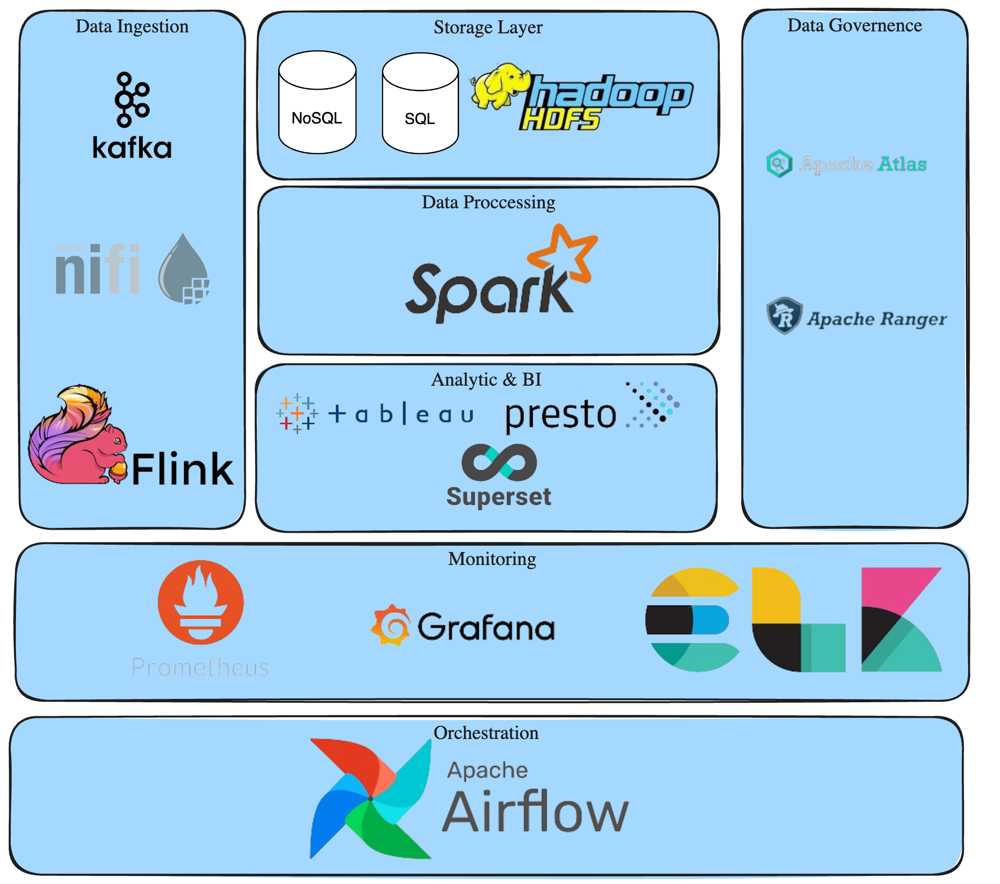

# Question No 1

## Kubernetes Cluster Provision
On this case I'm using ansible on my local environment with Virtual Box with base image of Ubuntu Server. With composition of 1 master node and 2 worker node. 

The playbook located at ***on-premise-cluster-creation/ansible/roles/kubernetes/tasks/main.yml*** needs to be run initially on the host where the Ansible playbook will be executed.

List of the IP which host belong as master or worker are can be see in the ***on-premise-cluster-creation/ansible/hosts***

## Airflow and Postgres Deployment
I'm using terraform to deploy airflow and postgres ultilizing helm chart of each resources. 

***question1/values.yaml*** needed to edit the default variable for airflow deployment.

This part of the variable need to be change if the airflow deployed using terraform, if not the application will not start as the migrations will not be run:

```yaml
createUserJob:
  useHelmHooks: false
  applyCustomEnv: false
migrateDatabaseJob:
  useHelmHooks: false
  applyCustomEnv: false
```

the DAG files will be sync on this github repo within the folder ***airflow/dags***. Configuration for this github sync is can be seen on this part:

```yaml
gitSync:
    enabled: true

    # git repo clone url
    # ssh example: git@github.com:apache/airflow.git
    # https example: https://github.com/apache/airflow.git
    repo: https://github.com/yogatristaa/allobank-test.git
    branch: main
    rev: HEAD
    # The git revision (branch, tag, or hash) to check out, v4 only
    # ref: v2-2-stable
    # depth: 1
    # the number of consecutive failures allowed before aborting
    maxFailures: 3
    # subpath within the repo where dags are located
    # should be "" if dags are at repo root
    subPath: "airflow/dags"
```

For, the DAG files itself its just a simple DAG file that will printing some words on each steps.

# Question No 2

## Big Data Platform Architecture
Below is general architecture of Big Data Platform with Example of the tools.

<p>
  
</p>  

## Capacity Planning

### 1. Workload Analysis
- On general to do capacity planning at first we need to list or what are workload of the planned system
- After that we can create a rough estimation of how much resource (CPU, memory, storage, network) that we will need based on the workload

### 2. Monitoring, Autoscaling, Disaster Recovery and Backup
- On designing system also needed to plan how we will monitor of the application or the resources itself. And how the approach if we need to scale the system in the future. Also, how the approach will be when doing recovery and backup of each resources.

### 3. Designing Architecture
- After we get the estimation of the needed resources we can start designing which architecture is suitable with all the mentioned aspect above.

### 4. Calculate System Capacity 
- After we have the architecture of the system with the needed component or resources we can calculate the estimation for the planned system.

